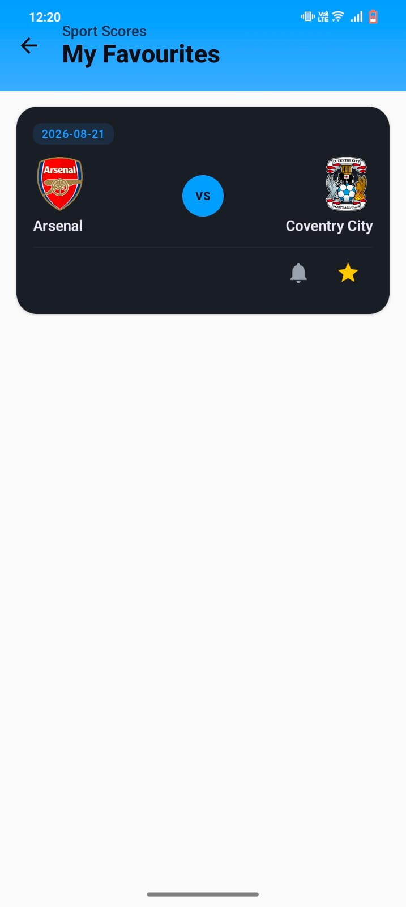
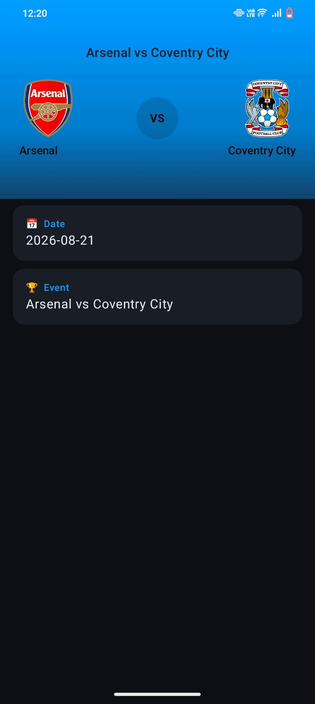
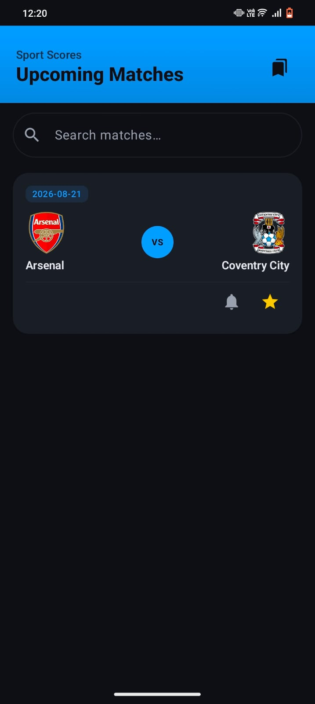

# Sports App

An Android app for tracking upcoming Premier League fixtures, built with
Kotlin and Jetpack Compose following MVVM architecture.

## 📸 Screenshots

| Favorites Screen | Details Screen | Match Screen |
|-----------|---------|---------|
|  |  |  |


## Features
- Live upcoming Premier League fixtures from TheSportsDB API
- Search matches by name in real time
- Tap any match to view match detail screen
- Star matches to save them as favorites (persisted with Room)
- Pull-to-refresh to reload latest fixtures
- Schedule match reminders via AlarmManager (notification fires after 30s)
- Empty state UI for favorites screen
- Team badges loaded from API using Coil

## Tech Stack
- Kotlin
- Jetpack Compose (fully declarative UI)
- MVVM Architecture
- Retrofit + Gson (REST API calls)
- TheSportsDB API (Premier League fixtures)
- Room Database (favorites persistence)
- Coil (image loading for team badges)
- AlarmManager + BroadcastReceiver (match reminders)
- Kotlin Coroutines (viewModelScope)
- Jetpack Navigation Compose
- Material Design 3

## Architecture
Follows MVVM pattern:

```
UI (Compose Screens)
    ↓
MatchViewModel (ViewModel)
    ↓
MatchRepository
    ↙        ↘
RetrofitInstance   AppDatabase (Room)
    ↓                  ↓
TheSportsDB API    FavoriteMatchDao
```

## Project Structure
```
com.example.sportsapp
├── data
│   └── MatchResponse.kt       → Match & MatchResponse data classes
├── database
│   ├── AppDatabase.kt         → Room Database singleton
│   ├── FavoriteMatch.kt       → Room Entity
│   └── FavoriteMatchDao.kt    → DAO (insert, delete, getAll)
├── network
│   ├── ApiService.kt          → Retrofit interface (TheSportsDB)
│   └── RetrofitInstance.kt    → Retrofit singleton
├── notifications
│   ├── NotificationHelper.kt  → Notification channel setup
│   └── ReminderReceiver.kt    → BroadcastReceiver for AlarmManager
├── repository
│   └── MatchRepository.kt     → Data layer (API + Room)
├── ui
│   ├── main
│   │   ├── MainActivity.kt        → NavHost setup, MatchItem composable
│   │   ├── MatchListScreen.kt     → Home screen with search & refresh
│   │   ├── MatchDetailScreen.kt   → Match name and date detail
│   │   └── FavoritesScreen.kt     → Saved favorites list
│   └── theme
│       ├── Color.kt
│       ├── Theme.kt
│       └── Type.kt
└── viewmodel
    └── MatchViewModel.kt      → Business logic, state holder
```

## Installation
1. Clone the repo
2. Open in Android Studio
3. Sync Gradle
4. Run on emulator or physical device (Android 8.0+)

> No API key required — uses TheSportsDB free tier

## What I Learned
- Building fully declarative UI with Jetpack Compose
- Integrating REST APIs with Retrofit and Gson
- Combining remote API data with local Room persistence
- Navigation between screens using Jetpack Navigation Compose
- Scheduling notifications with AlarmManager and BroadcastReceiver
- Managing UI state with Compose mutableStateOf in ViewModel

## Challenges Faced
- Managing shared ViewModel state across multiple Compose screens
- Keeping favorites in sync between Room database and UI state
- Setting up AlarmManager with proper PendingIntent flags for Android 12+

## Future Improvements
- Multiple leagues / sports support
- Live scores with auto-refresh
- Detailed match stats screen
- Push notifications for match day
- Dark mode

## License
MIT License
